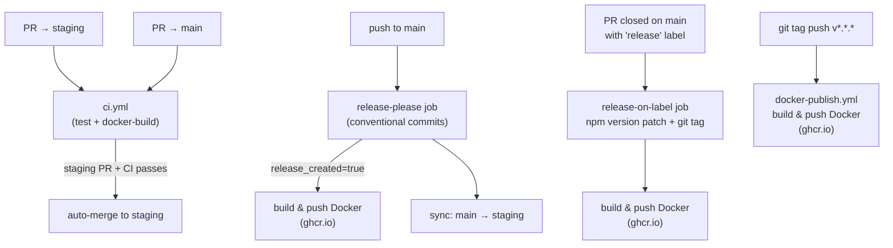
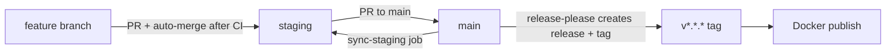

# CI/CD Workflows

## Overall Pipeline

---

## Workflows

### ci.yml
- **Triggers:** PRs to `main` and `staging`
- **Concurrency:** cancels in-progress runs for the same PR
- **Jobs:**
  - `test` — Node 24, `npm install --no-package-lock`, `npm test`; no `DATABASE_URL` — real-DB tests self-skip
  - `docker-build` — builds Docker image without pushing (Dockerfile smoke test)
  - `auto-merge` — runs only when PR targets `staging`; depends on `test` + `docker-build`; auto-approves and merges (preserves branch)

### docker-publish.yml
- **Trigger:** tag push matching `v*.*.*`
- **Job:** `build-and-push` — logs into `ghcr.io`, builds and pushes with tags (see table below)

### release-please.yml
- **Triggers:**
  - push to `main` → runs `release-please` + `sync-staging` jobs
  - PR closed on `main` → runs `release-on-label` job (if 'release' label present)
- **Jobs:**
  - `release-please` — uses `googleapis/release-please-action@v4` (`release-type: node`); parses conventional commits; auto-creates GitHub release + bumps `package.json` version; outputs `release_created` and `tag_name`
  - `build-and-push` — conditional on `release_created == 'true'`; builds and pushes Docker image
  - `sync-staging` — merges `main` → `staging` after every push to main
  - `release-on-label` — manual fallback release; fires when a PR to `main` is closed with the `release` label; runs `npm version patch`, creates git commit + tag, builds and pushes Docker image

---

## Docker Image Tags

All Docker publish paths produce the same tag set:

| Tag | Example |
|-----|---------|
| `latest` | `latest` |
| Full semver | `1.0.0` |
| Major.minor | `1.0` |
| Git SHA prefix | `sha-abc1234` |

**Registry:** `ghcr.io/<owner>/<repo>`

---

## Branch Strategy

- Feature branches → PR to `staging` → auto-merged after CI passes
- `staging` → PR to `main` → triggers release-please
- After release: `main` is auto-synced back to `staging`
- Manual release escape hatch: close a `staging → main` PR with the `release` label

---

## Release Paths Summary

| Path | How triggered | Version bump |
|------|--------------|--------------|
| release-please (primary) | Conventional commit merged to `main` | Auto (semver by commit type) |
| release-on-label (fallback) | PR to `main` closed with `release` label | `npm version patch` |
| docker-publish (standalone) | Manual `v*.*.*` tag push | N/A (tag already exists) |
