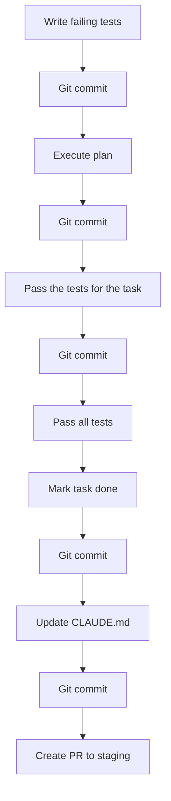

# Coding

## Coding Patterns
> **IMPORTANT**: MUST follow strictly

- Always verify your work
- Avoid over-engineering
- Keep functions small ang single-purpose

## Package / library ethics

- You must not pull or download packages that we don't need yet

### Use test driven development
> **IMPORTANT**: MUST follow strictly

## Coding Standards

### Path Handling
- Use relative paths: e.g. `.claude/rules/`
- Never hardcode absolute paths or home directories
- Use `path.join()` for cross-platform compatibility

### Naming Conventions
- Files: `kebab-case.js`, `PascalCase.js` (for classes)
- Functions/Variables: `camelCase`
- Constants: `UPPER_SNAKE_CASE`
- Components: `hyphenated-names`

### Error Handling
- Use try/catch for async operations
- Provide helpful error messages
- Log errors with context
- Implement fallback mechanisms

### Others
- Use 4 spaces indentation 