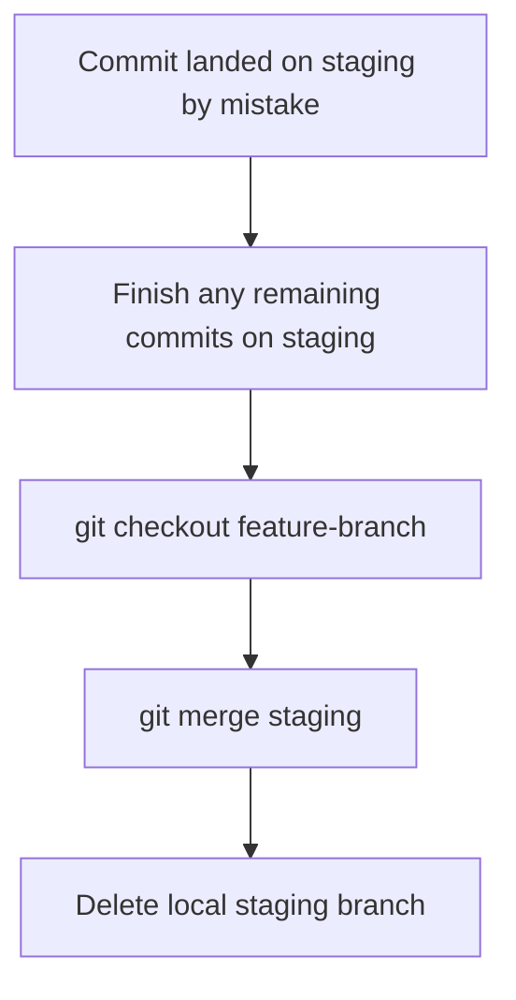

# Git & Build Workflow

## **IMPORTANT**: Git ethics — MUST follow strictly

- Do `git add` and `git commit` after every meaningful change (e.g., after writing tests, after implementing code, after fixing tests). Do NOT batch all work into a single commit at the end.
- Don't push directly to main or staging; only PRs should merge the changes to these branches
- **CRITICAL**: Always create a NEW branch for EACH plan execution (e.g., `feat/task-1.4-seed-script`). 
- Commit messages should be descriptive and follow conventional commit style

## PR merge strategy
- PRs to `staging`: use `--merge` (not `--squash` or `--rebase`) in `gh pr merge` / CI auto-merge

## **IMPORTANT** Default branch `main`
- Don't checkout main branch

## Recovery: stray commit on staging

## Recovery: stray uncommitted change on staging

