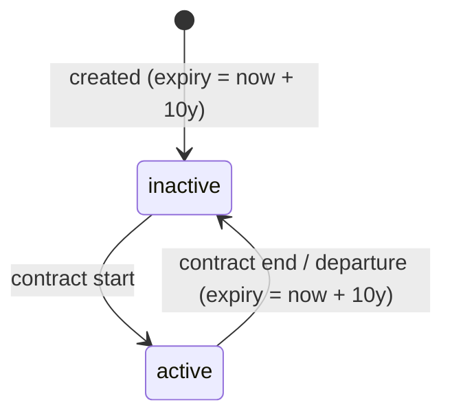
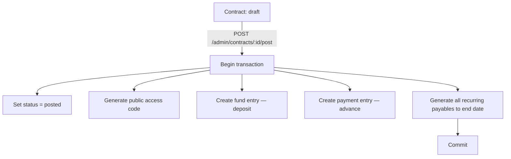

# Project Overview

## Tech Stack

| Layer | Technology |
|-------|-----------|
| Frontend | Next.js (React, App Router) |
| Backend | NestJS monolith |
| Database | PostgreSQL |
| ORM | Drizzle ORM (thin, explicit) |
| Auth | JWT — single seeded ADMIN user |
| Language | TypeScript (both apps) |
| Runtime | Node 24 |
| Package manager | npm (workspaces) |
| Container | Docker (`ghcr.io`) |
| CI/CD | GitHub Actions — see [ci-cd-workflows.md](./ci-cd-workflows.md) |

---

## Architecture

### Monorepo Layout

```
/
├── apps/
│   ├── api/            ← NestJS monolith (never publicly exposed)
│   │   └── src/
│   │       ├── auth/
│   │       ├── settings/
│   │       ├── spaces/
│   │       ├── tenants/
│   │       ├── contracts/
│   │       ├── ledgers/
│   │       ├── public-access/
│   │       └── audit/
│   └── web/            ← Next.js frontend (owns all public routing)
│       └── src/
│           └── app/
│               ├── admin/      ← protected admin routes
│               ├── dashboard/
│               ├── spaces/
│               ├── tenants/
│               ├── contracts/
│               ├── public/     ← tenant status view (no login)
│               └── entry/      ← tenant self-entry flow
├── package.json        ← npm workspaces root
├── Dockerfile
├── .env                ← never committed (see .env.example)
└── .env.example        ← committed, no real secrets
```

### Key Architectural Principles

- **The backend is never publicly exposed.** All external traffic hits Next.js; it calls the NestJS API server-side.
- **The frontend owns all public routing.** Tenant-facing views are Next.js routes, not direct browser API calls.
- **Database is the primary enforcement layer.** Constraints, triggers, and unique indexes encode business invariants — not only application logic.
- **ORM stays thin and explicit.** Avoid Drizzle query builders that obscure SQL intent; prefer explicit queries.
- **No premature abstractions in v1.** Add layers only when patterns repeat.

---

## Database Architecture

### Core Tables

| Table | Purpose |
|-------|---------|
| `spaces` | Rentable units; soft-delete only |
| `tenants` | Tenant records; never hard-deleted |
| `contracts` | Binds tenant to space; draft → posted (irreversible) |
| `payables` | What tenant owes per billing period; generated on contract post |
| `payments` | Money received; append-only; voidable |
| `fund` | Deposits and overpayments; does NOT reduce amount due |
| `settings` | Key-value runtime policy flags (e.g. `tenant.hide_expired`) |
| `app_version` | Diagnostic-only version row; set on first run |
| `admin_users` | Single seeded admin account |
| `public_access_codes` | Random, non-guessable codes for tenant status views |
| `audit` | Immutable log of void and state-change actions |

### Migration Layout

| File | Contents |
|------|---------|
| `0000_*.sql` | Generated by `db:generate` — all `CREATE TABLE` + `CREATE TYPE` |
| `0001_constraints_and_triggers.sql` | `uq_space_one_active_contract` partial unique index + `trg_tenant_expiration` trigger |
| `0002+` | Additional invariant migrations added per phase |

### Financial Model

Three independent ledgers:

```
amount_due = SUM(payables up to reference date) − SUM(payments)
```

- **Payables**: generated upfront at contract posting for every billing period up to end date.
- **Payments**: manually recorded by admin; append-only; corrections via void.
- **Fund**: security deposits and overpayments; displayed separately; does not offset amount due.

### Key Invariants (Enforced at DB Level)

- A space may have **only one active/posted contract** at a time.
- Posted contract core fields are **immutable**: start/end dates, rent amount, billing frequency, due date rule.
- Tenants are **never hard-deleted**.
- Spaces are **soft-deleted only** (`deleted_at`).
- Tenant expiration is managed by a **database trigger** on status transition to `inactive`.
- Payment void actions produce an **audit record**.

### Tenant Status Lifecycle



### Contract Posting Flow



---

## Key Commands

### Development

```bash
# Install all workspace dependencies
npm install

# Run both apps in development mode
npm run dev

# Run API only
npm run dev --workspace=apps/api

# Run web only
npm run dev --workspace=apps/web
```

### Testing

```bash
# Run all tests (no DATABASE_URL needed — DB tests self-skip)
npm test

# Watch mode
npm run test:watch

# Coverage report
npm run test:coverage
```

### Database / Drizzle

```bash
# Generate migration files from schema changes
npm run db:generate --workspace=apps/api

# Run pending migrations
npm run db:migrate --workspace=apps/api

# Seed initial data (admin user, settings, app_version)
npm run db:seed --workspace=apps/api
```

### Docker

```bash
# Build image locally (smoke test — no push)
docker build -t kasero .

# Run with environment file
docker run --env-file .env -p 3001:3001 kasero
```

---

## CI/CD

See [ci-cd-workflows.md](./ci-cd-workflows.md) for the full pipeline diagram and workflow details.

**Summary:**

| Event | Workflow | Outcome |
|-------|----------|---------|
| PR to `staging` or `main` | `ci.yml` | Runs `npm test` + docker build smoke test |
| PR to `staging` (CI passes) | `ci.yml` auto-merge job | Auto-merges PR to staging |
| Push to `main` | `release-please.yml` | Conventional commits → GitHub release + Docker push to `ghcr.io` |
| PR to `main` closed with `release` label | `release-please.yml` | `npm version patch` + tag + Docker push |
| Manual `v*.*.*` tag push | `docker-publish.yml` | Docker build and push |

Registry: `ghcr.io/<owner>/kasero`

---

## API Endpoints

### Admin Endpoints (JWT required)

| Method | Path | Purpose |
|--------|------|---------|
| `*` | `/admin/spaces` | Space CRUD |
| `*` | `/admin/tenants` | Tenant CRUD |
| `*` | `/admin/contracts` | Contract CRUD (draft state) |
| `POST` | `/admin/contracts/:id/post` | Post (finalize) a contract — irreversible |
| `GET` | `/admin/contracts/:id/ledger` | View payables, payments, fund for contract |
| `*` | `/admin/contracts/:id/payments` | Record payments against a contract |
| `POST` | `/admin/payments/:id/void` | Void a payment (auditable) |

### Internal Frontend-Only Endpoint

| Method | Path | Purpose |
|--------|------|---------|
| `GET` | `/internal/contracts/public/:code` | Resolve contract by public code for tenant status view |

---

## Common Issues

**Tests skip unexpectedly**
Tests that require a real database self-skip when `DATABASE_URL` is not set. This is by design for CI. Run with a local `DATABASE_URL` to execute database-backed tests.

**Migrations fail on startup**
Ensure `DATABASE_URL` is set and the PostgreSQL instance is reachable before starting the API. Drizzle runs migrations on startup.

**Seeded admin not created**
The seed script is idempotent — it only inserts if the admin record does not exist. Verify `ADMIN_USERNAME` and `ADMIN_PASSWORD` are set in `.env`.

**Contract posting appears partial**
Contract posting is a single atomic transaction. If any step fails (payable generation, fund entry, etc.), the entire transaction rolls back. Check API logs for the specific constraint violation.

**Tenant expiration not updating**
Tenant expiration is managed by a database trigger. If it behaves unexpectedly, verify the trigger was created during the migration step.

---

## Important Notes

- **Timezone**: All user-facing date behavior resolves to `Asia/Manila`. Store contract/business dates as date-only values (no time component). Set `TZ=Asia/Manila` in the environment.
- **No hard deletes**: Spaces use soft delete (`deleted_at`). Tenants and financial records are never deleted.
- **Posted contracts are immutable**: Core financial fields (start date, end date, rent amount, billing frequency, due date rule) cannot be changed after posting. Enforce at both API layer and with database constraints.
- **Public code security**: The public access code must be random, non-guessable, unique, and revocable. Never expose internal contract IDs publicly.
- **Backend isolation**: The NestJS API must never be reachable directly from the internet. Route all external traffic through Next.js.
- **v1 scope guardrails**: Online payments, contract cancellation, proration, deposit refunds, PDF generation, RBAC expansion, and reporting are explicitly out of scope for v1. Do not add them.
- **TDD workflow**: Write failing tests first, commit, then implement, commit, then verify all tests pass. See [coding-guidelines.md](./coding-guidelines.md).
