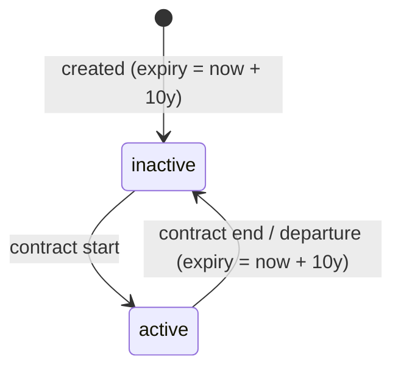
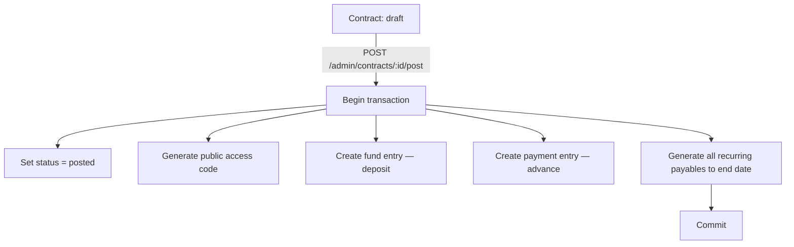

# Kasero 

## Memory files

## Qwen Added Memories

- [@./docs/coding-guidelines.md](./docs/coding-guidelines.md) - Coding guidelines, standards, and patterns
- [@./docs/testing-patterns.md](./docs/testing-patterns.md) - Testing patterns
- [@./docs/git-workflow.md](./docs/git-workflow.md) - Git workflow — **MUST follow for every task**: new branch per plan, commit after each meaningful change, open PR (never push directly to main/staging)
- [@./docs/service-workflows.md](./docs/service-workflows.md)
- [@./docs/ci-cd-workflows.md](./docs/ci-cd-workflows.md) - Github actions documentation
- [@./docs/security-guidelines.md](./docs/security-guidelines.md) - Security guidelines

## Project Overview

#### Tech Stack

| Layer | Technology |
|-------|-----------|
| Frontend | Next.js (React, App Router) |
| Backend | NestJS monolith |
| Database | PostgreSQL |
| ORM | Drizzle ORM (thin, explicit) |
| Auth | JWT — single seeded ADMIN user |
| Language | TypeScript (both apps) |
| Runtime | Node 24 |
| Package manager | npm (workspaces) |
| Container | Docker (`ghcr.io`) |
| CI/CD | GitHub Actions — see [@./docs/ci-cd-workflows.md](./docs/ci-cd-workflows.md) |

#### Architecture

###### Monorepo Layout

```
/
├── apps/
│   ├── api/            ← NestJS monolith (never publicly exposed)
│   │   └── src/
│   │       ├── auth/
│   │       ├── settings/
│   │       ├── spaces/
│   │       ├── tenants/
│   │       ├── contracts/
│   │       ├── ledgers/
│   │       ├── public-access/
│   │       └── audit/
│   └── web/            ← Next.js frontend (owns all public routing)
│       └── src/
│           └── app/
│               ├── admin/      ← protected admin routes
│               ├── dashboard/
│               ├── spaces/
│               ├── tenants/
│               ├── contracts/
│               ├── public/     ← tenant status view (no login)
│               └── entry/      ← tenant self-entry flow
├── package.json        ← npm workspaces root
├── Dockerfile
├── .env                ← never committed (see .env.example)
└── .env.example        ← committed, no real secrets
```

###### Key Architectural Principles

- **The backend is never publicly exposed.** All external traffic hits Next.js; it calls the NestJS API server-side.
- **The frontend owns all public routing.** Tenant-facing views are Next.js routes, not direct browser API calls.
- **Database is the primary enforcement layer.** Constraints, triggers, and unique indexes encode business invariants — not only application logic.
- **ORM stays thin and explicit.** Avoid Drizzle query builders that obscure SQL intent; prefer explicit queries.
- **No premature abstractions in v1.** Add layers only when patterns repeat.

#### Database Architecture

###### Core Tables

| Table | Purpose |
|-------|---------|
| `spaces` | Rentable units; soft-delete only |
| `tenants` | Tenant records; never hard-deleted |
| `contracts` | Binds tenant to space; draft → posted (irreversible) |
| `payables` | What tenant owes per billing period; generated on contract post |
| `payments` | Money received; append-only; voidable |
| `fund` | Deposits and overpayments; does NOT reduce amount due |
| `settings` | Key-value runtime policy flags (e.g. `tenant.hide_expired`) |
| `app_version` | Diagnostic-only version row; set on first run |
| `admin_users` | Single seeded admin account |
| `public_access_codes` | Random, non-guessable codes for tenant status views |
| `audit` | Immutable log of void and state-change actions |

###### Migration Layout

| File | Contents |
|------|---------|
| `0000_*.sql` | Generated by `db:generate` — all `CREATE TABLE` + `CREATE TYPE` |
| `0001_constraints_and_triggers.sql` | `uq_space_one_active_contract` partial unique index + `trg_tenant_expiration` trigger |
| `0002+` | Additional invariant migrations added per phase |

###### Financial Model

Three independent ledgers:

```
amount_due = SUM(payables up to reference date) − SUM(payments)
```

- **Payables**: generated upfront at contract posting for every billing period up to end date.
- **Payments**: manually recorded by admin; append-only; corrections via void.
- **Fund**: security deposits and overpayments; displayed separately; does not offset amount due.

###### Key Invariants (Enforced at DB Level)

- A space may have **only one active/posted contract** at a time.
- Posted contract core fields are **immutable**: start/end dates, rent amount, billing frequency, due date rule.
- Tenants are **never hard-deleted**.
- Spaces are **soft-deleted only** (`deleted_at`).
- Tenant expiration is managed by a **database trigger** on status transition to `inactive`.
- Payment void actions produce an **audit record**.

###### Tenant Status Lifecycle



###### Contract Posting Flow



#### Key Commands

###### Development

```bash
## Install all workspace dependencies
npm install

## Run both apps in development mode
npm run dev

## Run API only
npm run dev --workspace=apps/api

## Run web only
npm run dev --workspace=apps/web
```

###### Database / Drizzle

```bash
## Generate migration files from schema changes
npm run db:generate --workspace=apps/api

## Run pending migrations
npm run db:migrate --workspace=apps/api

## Seed initial data (admin user, settings, app_version)
npm run db:seed --workspace=apps/api
```

###### Docker

```bash
## Build image locally (smoke test — no push)
docker build -t kasero .

## Run with environment file
docker run --env-file .env -p 3001:3001 kasero
```

#### API Endpoints

###### Admin Endpoints (JWT required)

| Method | Path | Purpose |
|--------|------|---------|
| `*` | `/admin/spaces` | Space CRUD |
| `*` | `/admin/tenants` | Tenant CRUD |
| `*` | `/admin/contracts` | Contract CRUD (draft state) |
| `POST` | `/admin/contracts/:id/post` | Post (finalize) a contract — irreversible |
| `GET` | `/admin/contracts/:id/ledger` | View payables, payments, fund for contract |
| `*` | `/admin/contracts/:id/payments` | Record payments against a contract |
| `POST` | `/admin/payments/:id/void` | Void a payment (auditable) |

###### Internal Frontend-Only Endpoint

| Method | Path | Purpose |
|--------|------|---------|
| `GET` | `/internal/contracts/public/:code` | Resolve contract by public code for tenant status view |

#### Important Notes

- **Timezone**: All user-facing date behavior resolves to `Asia/Manila`. Store contract/business dates as date-only values (no time component). Set `TZ=Asia/Manila` in the environment.
- **No hard deletes**: Spaces use soft delete (`deleted_at`). Tenants and financial records are never deleted.
- **Posted contracts are immutable**: Core financial fields (start date, end date, rent amount, billing frequency, due date rule) cannot be changed after posting. Enforce at both API layer and with database constraints.
- **Public code security**: The public access code must be random, non-guessable, unique, and revocable. Never expose internal contract IDs publicly.
- **Backend isolation**: The NestJS API must never be reachable directly from the internet. Route all external traffic through Next.js.
- **v1 scope guardrails**: Online payments, contract cancellation, proration, deposit refunds, PDF generation, RBAC expansion, and reporting are explicitly out of scope for v1. Do not add them.
- **TDD workflow**: Write failing tests first, commit, then implement, commit, then verify all tests pass. See [@./docs/coding-guidelines.md](./docs/coding-guidelines.md).

## QA / SIT / UAT

- SIT/UAT test cases live in `specs/v1/qa/cycle-N/plan.md` (e.g. `cycle-1`, `cycle-2`)
- These are user-facing test cases — written as if the tester knows nothing about the code
- Each test case includes: ID, Priority (P1/P2/P3), Preconditions, Steps, Expected Result
- When creating new SIT/UAT cycles, base them only on documentation — do NOT reference code internals
- The execution summary table at the end of each plan is filled in by human testers

## **IMPORTANT**: Plan Execution Workflow
- Plans and spec files describe **what** to build — they do NOT override the mandatory TDD workflow
- When executing any plan (e.g., `@specs/v1/issues/XXXX/plan.md`), the mandatory task checklist applies to **each phase or section independently** — no exceptions
- For every phase: write failing tests first → commit → implement → commit → run full test suite → update memory md files → commit memory md files → open PR to staging
- Tests passing (step 5) is **NOT** phase completion — steps 7–9 are mandatory deliverables for every phase
- Do NOT start the next phase until the current one has an open PR on staging
- After tests pass, immediately ask: "Have I updated memory md files? Have I opened a PR to staging?" If no to either — do it now before continuing

> **CRITICAL**: Plan files describe WHAT to build. They do NOT override the mandatory workflow in the memory files.
> If a plan's section omits the PR step or names a wrong target branch, the memory files takes precedence. Always PR to `staging`, never directly to `main`.

## **IMPORTANT**: CLAUDE.md / memory files management
- Always use mermaid.js syntax for workflows

## **IMPORTANT**: README.md management
- Always update README.md for any relevant updates to the repository
- Always create a PR to staging after every completed task — never push directly

## **IMPORTANT**: Do not load nor scan to context unless explicitly mentioned for the files / folders below
./specs/*


## MANDATORY TASK CHECKLIST
> Every task — no exceptions, no shortcuts, even for small changes

Before marking any task done, confirm ALL of the following were done **in order**:

- [ ] **1. Write FAILING tests first** — commit them before writing implementation code
- [ ] **2. Commit failing tests** — message: `test: add failing tests for <feature>`
- [ ] **3. Implement minimum code** to make tests pass
- [ ] **4. Commit implementation** — message: `feat/fix: <description>`
- [ ] **5. Run ALL tests** (`npm test` from repo root or workspace) — not just the new ones
- [ ] **6. Commit passing state** if additional fixes were needed
- [ ] **7. Update memory md files** with any new patterns or learnings from this session
- [ ] **8. Commit memory md files update**
- [ ] **9. Open a PR to staging** — never end a task with only local commits

## VIOLATIONS TO NEVER REPEAT

- **Do NOT write tests and implementation in the same commit** — failing tests must be committed first, separately
- **Do NOT skip running the full test suite** — `src/profile` alone is not enough
- **Do NOT skip memory md files update** — it is a mandatory step, not optional housekeeping
- **Do NOT end a task without a PR to staging** — commits that never become a PR are invisible to CI
