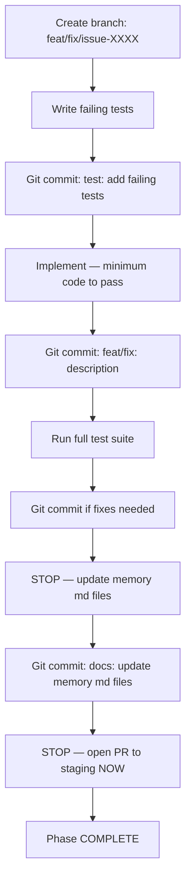

# Kasero 

## Memory files

- [coding-guidelines.md](./docs/coding-guidelines.md) - Coding guidelines, standards, and patterns
- [testing-patterns.md](./docs/testing-patterns.md) - Testing patterns
- [git-workflow.md](./docs/git-workflow.md) - Git recovery procedures reference
- [service-workflows.md](./docs/service-workflows.md)
- [ci-cd-workflows.md](./docs/ci-cd-workflows.md) - Github actions documentation
- [security-guidelines.md](./docs/security-guidelines.md) - Security guidelines
- [project-overview.md](./docs/project-overview.md) - Project overview, architecture, DB model

## **IMPORTANT**: Git Workflow — MUST follow

- Do `git add` and `git commit` after every meaningful change (e.g., after writing tests, after implementing code, after fixing tests). Do NOT batch all work into a single commit at the end.
- Never push directly to main or staging — only PRs should merge changes to these branches
- **CRITICAL**: Always create a NEW branch for EACH plan execution (e.g., `feat/task-1.4-seed-script`)
- Commit messages must be descriptive and follow conventional commit style
- PRs to `staging`: use `--merge` (not `--squash` or `--rebase`) in `gh pr merge` / CI auto-merge
- Never checkout the `main` branch directly

## **IMPORTANT**: Plan Execution Workflow
- Plans and spec files describe **what** to build — they do NOT override the mandatory TDD workflow
- When executing any plan (e.g., `@specs/v1/issues/XXXX/plan.md`), the mandatory task checklist applies to **each phase or section independently** — no exceptions
- For every phase: write failing tests first → commit → implement → commit → run full test suite → update memory md files → commit memory md files → open PR to staging
- Tests passing (step 5) is **NOT** phase completion — steps 7–9 are mandatory deliverables for every phase
- Do NOT start the next phase until the current one has an open PR on staging
- After tests pass, immediately ask: "Have I updated memory md files? Have I opened a PR to staging?" If no to either — do it now before continuing

> **CRITICAL**: Plan files describe WHAT to build. They do NOT override the mandatory workflow in the memory files.
> If a plan's section omits the PR step or names a wrong target branch, the memory files takes precedence. Always PR to `staging`, never directly to `main`.

## **IMPORTANT**: CLAUDE.md / memory files management
- Always use mermaid.js syntax for workflows

## **IMPORTANT**: README.md management
- Always update README.md for any relevant updates to the repository
- Always create a PR to staging after every completed task — never push directly

## **IMPORTANT**: Do not load nor scan to context unless explicitly mentioned for the files / folders below
./specs/*

## MANDATORY TASK CHECKLIST
> Every task — no exceptions, no shortcuts, even for small changes

> **STOP nodes are hard gates** — reach one, do that step before reading further.
> Tests passing is not task completion. The open PR is the deliverable.

Before marking any task done, confirm ALL of the following were done **in order**:

- [ ] **1. Write FAILING tests first** — commit them before writing implementation code
- [ ] **2. Commit failing tests** — message: `test: add failing tests for <feature>`
- [ ] **3. Implement minimum code** to make tests pass
- [ ] **4. Commit implementation** — message: `feat/fix: <description>`
- [ ] **5. Run ALL tests** (`npm test` from repo root or workspace) — not just the new ones
- [ ] **6. Commit passing state** if additional fixes were needed
- [ ] **7. Update memory md files** with any new patterns or learnings from this session
- [ ] **8. Commit memory md files update**
- [ ] **9. Open a PR to staging** — never end a task with only local commits

## VIOLATIONS TO NEVER REPEAT

- **Do NOT write tests and implementation in the same commit** — failing tests must be committed first, separately
- **Do NOT skip running the full test suite** — `src/profile` alone is not enough
- **Do NOT skip memory md files update** — it is a mandatory step, not optional housekeeping
- **Do NOT end a task without a PR to staging** — commits that never become a PR are invisible to CI
