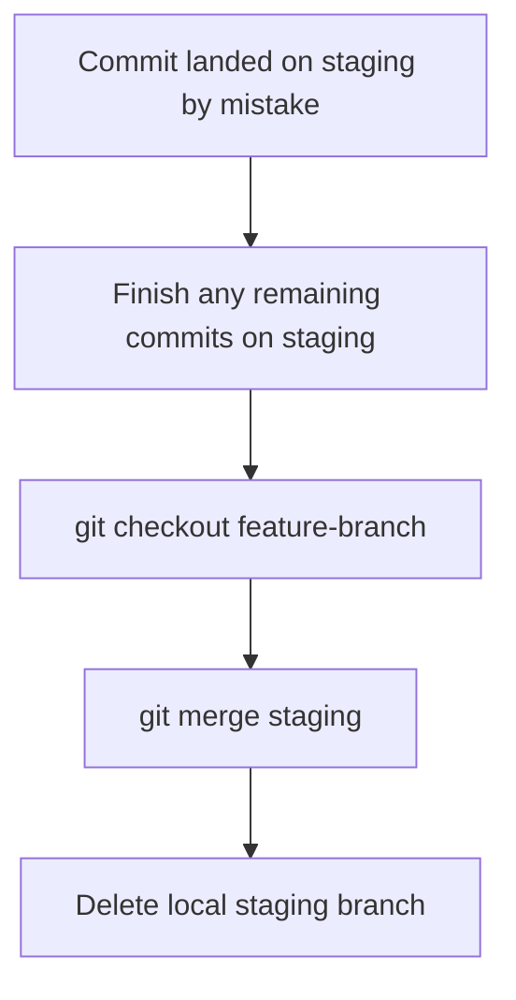

# Git Recovery Reference

## Recovery: stray commit on staging

```mermaid
graph TD
    A[Commit landed on staging by mistake] --> B[Finish any remaining commits on staging]
    B --> C[git checkout feature-branch]
    C --> D[git merge staging]
    D --> E[Delete local staging branch]
```

## Recovery: stray uncommitted change on staging

```mermaid
graph LR
    A[Unstaged edit blocks checkout] --> B[git stash] --> C[git checkout branch] --> D[git stash pop]
```
