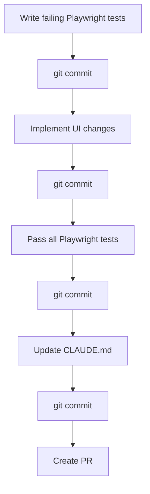

# Plan: Frontend UI Overhaul + Playwright E2E Tests

## Context

The Kasero frontend is functionally complete but visually raw. Most pages use zero Tailwind classes (raw `<main><h1>` HTML), the admin area has no navigation shell, the login page is an empty stub, and inline `style={{...}}` objects are used throughout the admin pages. There are no E2E tests — only trivial Jest smoke tests. This plan redesigns all pages with Tailwind CSS and adds Playwright tests covering every user-facing flow.

**Outcome:** A clean, professional UI with consistent styling across public and admin flows, a working login form, admin sidebar navigation, and a full Playwright E2E test suite with API mocking via a globalSetup mock server (since admin pages use server-side fetch, not browser fetch).

---

## Approach

- **Styling**: Tailwind CSS 4 (already installed) — no new UI libraries
- **Auth**: Middleware-based guard (replaces layout-level redirect) + route group `(protected)` to cleanly separate the login page from the sidebar layout
- **Login**: Client component form → Next.js Route Handler → NestJS API proxy (keeps backend internal)
- **Playwright**: `@playwright/test`, API mocked via a `globalSetup` mock HTTP server (Node.js built-in) on port 3099. `INTERNAL_API_URL=http://localhost:3099` passed to the Next.js dev server.
- **TDD**: Write all failing Playwright tests first, commit, then implement UI, commit, verify all pass

---

## TDD Workflow



---

## Files to Create / Modify

### New files
| File | Purpose |
|------|---------|
| `apps/web/playwright.config.ts` | Playwright config — chromium, baseURL localhost:3000, webServer starts `next dev` with `INTERNAL_API_URL=http://localhost:3099` |
| `apps/web/e2e/global-setup.ts` | Starts a mock HTTP server on port 3099 with fixture data for all API paths |
| `apps/web/e2e/home.spec.ts` | Home page: form renders, navigates on submit, no nav on blank |
| `apps/web/e2e/public.spec.ts` | Public view: amount due, payables table, fund, error states |
| `apps/web/e2e/entry.spec.ts` | Entry form: valid/invalid/used token, submit success, submit error |
| `apps/web/e2e/admin-login.spec.ts` | Login: form renders, invalid creds error, redirect on success |
| `apps/web/e2e/admin-dashboard.spec.ts` | Dashboard: spaces table, status badges, sidebar nav, empty state |
| `apps/web/e2e/admin-space.spec.ts` | Space detail: name, description, contracts table, empty state |
| `apps/web/e2e/admin-contract.spec.ts` | Contract detail: summary, amount due, payables/payments/fund tables |
| `apps/web/middleware.ts` | Auth guard: unauthenticated → `/admin/login`; authenticated on login → `/admin/dashboard` |
| `apps/web/app/admin/(protected)/layout.tsx` | Sidebar layout (server component, wraps authenticated admin routes) |
| `apps/web/app/admin/_components/admin-nav.tsx` | `'use client'` nav with `usePathname()` active state |
| `apps/web/app/admin/login/login-form.tsx` | `'use client'` login form component |
| `apps/web/app/api/auth/login/route.ts` | Route Handler: proxies POST to NestJS, sets `auth_token` cookie |
| `apps/web/app/api/auth/logout/route.ts` | Route Handler: deletes `auth_token` cookie, redirects to login |
| `apps/web/app/admin/(protected)/dashboard/page.tsx` | Moved from `admin/dashboard/page.tsx` (URL unchanged) |
| `apps/web/app/admin/(protected)/spaces/[id]/page.tsx` | Moved from `admin/spaces/[id]/page.tsx` (URL unchanged) |
| `apps/web/app/admin/(protected)/contracts/[id]/page.tsx` | Moved from `admin/contracts/[id]/page.tsx` (URL unchanged) |
| `apps/web/app/admin/(protected)/tenants/[id]/page.tsx` | Moved stub |

### Modified files
| File | Change |
|------|--------|
| `apps/web/package.json` | Add `@playwright/test` devDep; add `"test:e2e": "playwright test"` script |
| `apps/web/jest.config.ts` | Add `testPathIgnorePatterns: ['<rootDir>/e2e/']` |
| `apps/web/app/layout.tsx` | Fix metadata: `title: 'Kasero'`, `description: 'Apartment rental management'` |
| `apps/web/app/globals.css` | Clean up base styles |
| `apps/web/app/page.tsx` | Full Tailwind styling — centered card, branded header |
| `apps/web/app/public/layout.tsx` | Centered layout wrapper with "Kasero" brand header |
| `apps/web/app/public/[code]/page.tsx` | Full Tailwind styling — amount due callout, tables, fund list, error cards |
| `apps/web/app/entry/layout.tsx` | Centered layout wrapper (same as public) |
| `apps/web/app/entry/[token]/page.tsx` | Styled error/used state cards |
| `apps/web/app/entry/[token]/entry-form.tsx` | Full Tailwind styling — labeled inputs, error callout, success state |
| `apps/web/app/admin/layout.tsx` | Becomes thin shell `<>{children}</>` (auth now in middleware) |
| `apps/web/app/admin/login/page.tsx` | Renders `<LoginForm />` |

---

## Key Design Decisions

### Route Structure
Use Next.js route group `(protected)` to separate the sidebar layout from the login page:
```
app/admin/
  layout.tsx              ← thin shell (no guard, no sidebar)
  login/page.tsx          ← full-page centered login (no sidebar)
  (protected)/
    layout.tsx            ← sidebar + dark nav (server component)
    dashboard/page.tsx
    spaces/[id]/page.tsx
    contracts/[id]/page.tsx
    tenants/[id]/page.tsx
```
URLs are unchanged (`/admin/dashboard`, etc.).

### Auth Flow
```
middleware.ts → checks auth_token cookie → guards /admin/* except /admin/login
LoginForm → POST /api/auth/login → Route Handler → NestJS /auth/login → sets auth_token cookie → redirect to dashboard
logout button → POST /api/auth/logout → Route Handler → deletes cookie → redirect to login
```

### Playwright API Mocking Strategy
Admin pages use server-side `fetch()` (Node.js, not browser) so `page.route()` cannot intercept them. Solution:
- `globalSetup.ts` starts a lightweight `http.createServer` on port 3099 serving fixture JSON keyed by URL path
- `playwright.config.ts` passes `INTERNAL_API_URL=http://localhost:3099` as env to `webServer`
- Public-facing client-side fetches (entry form POST) use `page.route()` normally
- Dashboard/spaces/contracts tests use `globalSetup` fixture data (no per-test route mocking needed for server-side)

### Color System (Tailwind)
| Use | Classes |
|-----|---------|
| Page bg | `min-h-screen bg-slate-50` |
| Card | `bg-white rounded-2xl border border-slate-200 shadow-sm p-8` |
| Input | `w-full border border-slate-300 rounded-lg px-4 py-2.5 text-sm focus:outline-none focus:ring-2 focus:ring-slate-500` |
| Primary btn | `w-full bg-slate-800 text-white rounded-lg px-4 py-2.5 text-sm font-medium hover:bg-slate-700 transition-colors` |
| Error callout | `text-sm text-red-600 bg-red-50 border border-red-200 rounded-lg px-4 py-2.5` |
| Sidebar | `w-56 bg-slate-900 flex flex-col` |
| Badge: overdue | `bg-red-100 text-red-800 text-xs font-semibold px-2 py-0.5 rounded` |
| Badge: nearing | `bg-yellow-100 text-yellow-800 text-xs font-semibold px-2 py-0.5 rounded` |
| Badge: occupied | `bg-green-100 text-green-800 text-xs font-semibold px-2 py-0.5 rounded` |
| Badge: vacant | `bg-slate-100 text-slate-600 text-xs font-semibold px-2 py-0.5 rounded` |
| Amount due (>0) | `text-red-600 font-bold text-2xl font-mono` |
| Amount due (=0) | `text-green-700 font-bold text-2xl font-mono` |

---

## Verification

1. `npm install --workspace=apps/web` — installs `@playwright/test`
2. `npx playwright install chromium --workspace=apps/web` — downloads browser
3. `npm run test:e2e --workspace=apps/web` — all 7 spec files pass
4. `npm test --workspace=apps/web` — existing Jest tests still pass
5. `npm run dev --workspace=apps/web` — visual check of all pages at localhost:3000
6. Manual check: `/`, `/public/TESTCODE`, `/entry/TESTTOKEN`, `/admin/login`, `/admin/dashboard`
