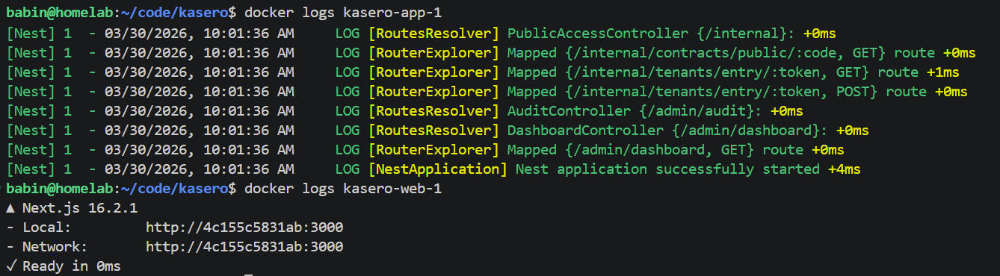
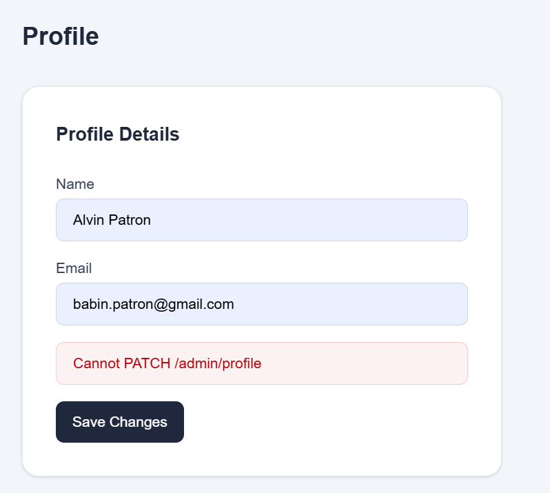
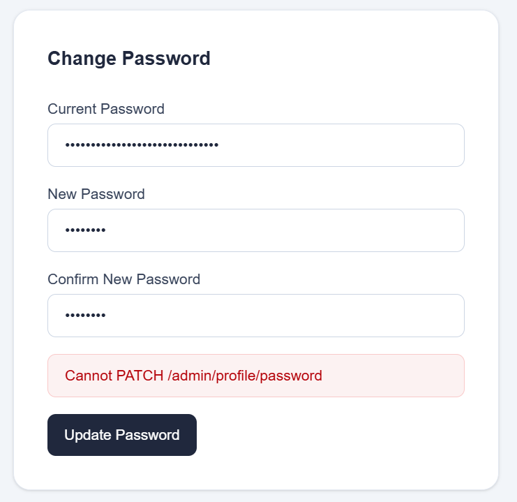
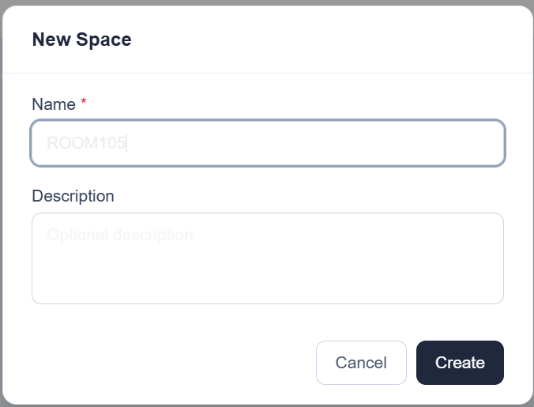
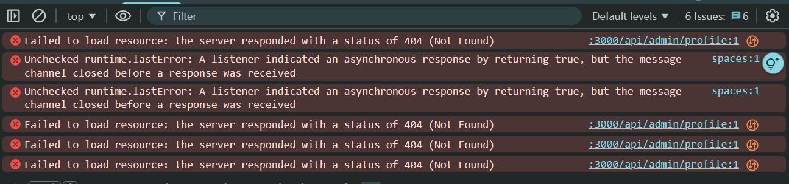
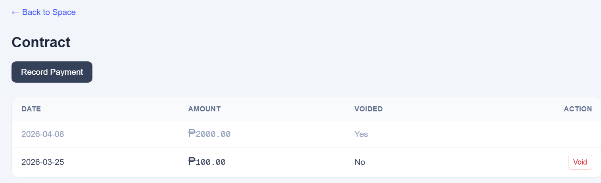
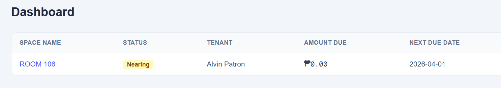

# Issues

## Mobile site
- Can't login

## Docker logs
- The logs don't show when there are issues / errors

## Profile
- Update of profile and password have errors

## Spaces
- Font color is illegible; all input text should be visible to the naked eye

- Accessing a space's contract has a link to go back to dashboard instead of the Spaces. Steps to replicate: click on spaces > click on a space > will be redirected to the contracts under the space > "Back to Dashboard" is shown 

## Console logs have errors 

## Voided contracts
- Voided contracts still allow payments

- Voided contracts still has the tenant linked and the due dates. Voiding the contract should remove it as the active one.

## Contracts
- Contracts should not have its own collective view. They should be under spaces
- When a user clicks on a space, he will be redirected to the space details (readonly)
- Under that edit form should be a table listing the contracts under the space orderd by status (active first), date (desc)
- There are also 2 sections of payments: one has the actual payments made, the one at the bottom has none on the list
- New payments should also default to current date in the form

## Dashboard x Spaces
- Use the dashboard view as "Spaces" and remove the current Spaces page
- The new Spaces should also have New, Edit, Delete

## Menu
- Should only have Spaces and Tenants
- Profile updating should be thru a link when the profile is clicked

## Calculations
- 2 separate fields in contracts: billing date and due date
- amount due - should be calculated based on billing. when billing date comes, amount due = previous balance + current due
- due date - deadline - should dictate the status (e.g. overdue, nearing, etc. -- should always use overdue when there are overdue payments)

## CI issue
Summary of all failing tests
FAIL public-access/public-access.service.spec.ts
  ● PublicAccessService › getPublicStatus › returns contractId and ledger for a valid active code

    NotFoundException: Invalid or expired access code

      14 |     async getPublicStatus(code: string, referenceDate?: string) {
      15 |         const UUID_RE = /^[0-9a-f]{8}-[0-9a-f]{4}-[0-9a-f]{4}-[0-9a-f]{4}-[0-9a-f]{12}$/i;
    > 16 |         if (!UUID_RE.test(code)) throw new NotFoundException('Invalid or expired access code');
         |                                        ^
      17 |
      18 |         const rows = await this.db
      19 |             .select({ contractId: publicAccessCodes.contractId })

      at PublicAccessService.getPublicStatus (public-access/public-access.service.ts:16:40)
      at Object.<anonymous> (public-access/public-access.service.spec.ts:51:42)

  ● PublicAccessService › getPublicStatus › passes referenceDate to getLedger

    NotFoundException: Invalid or expired access code

      14 |     async getPublicStatus(code: string, referenceDate?: string) {
      15 |         const UUID_RE = /^[0-9a-f]{8}-[0-9a-f]{4}-[0-9a-f]{4}-[0-9a-f]{4}-[0-9a-f]{12}$/i;
    > 16 |         if (!UUID_RE.test(code)) throw new NotFoundException('Invalid or expired access code');
         |                                        ^
      17 |
      18 |         const rows = await this.db
      19 |             .select({ contractId: publicAccessCodes.contractId })

      at PublicAccessService.getPublicStatus (public-access/public-access.service.ts:16:40)
      at Object.<anonymous> (public-access/public-access.service.spec.ts:71:27)

